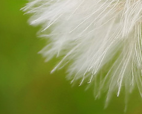
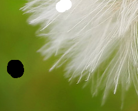
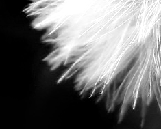
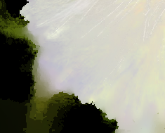

# Closed-Form Matting


Python implementation of image matting method proposed in A. Levin D. Lischinski and Y. Weiss. A Closed Form Solution to Natural Image Matting. IEEE Conf. on Computer Vision and Pattern Recognition (CVPR), June 2006, New York

The repository also contains implementation of background/foreground reconstruction method proposed in Levin, Anat, Dani Lischinski, and Yair Weiss. "A closed-form solution to natural image matting." IEEE Transactions on Pattern Analysis and Machine Intelligence 30.2 (2008): 228-242.

## Requirements
- python 3.5+ (Though it should run on 2.7)
- scipy
- numpy
- opencv-python


## Usage

### Closed-Form matting
CLI inerface:

```bash
# Scribbles input
./closed_form_matting.py input_image.png -s scribbles_image.png  -o output_alpha.png

# Trimap input
./closed_form_matting.py input_image.png -t scribbles_image.png  -o output_alpha.png

# Add flag --solve-fg to compute foreground color and output RGBA image instead
# of alpha.
```


Python interface:

```python
import closed_form_matting
...
# For scribles input
alpha = closed_form_matting.closed_form_matting_with_scribbles(image, scribbles)

# For trimap input
alpha = closed_form_matting.closed_form_matting_with_trimap(image, trimap)

# For prior with confidence
alpha = closed_form_matting.closed_form_matting_with_prior(
    image, prior, prior_confidence, optional_const_mask)

# To get Matting Laplacian for image
laplacian = compute_laplacian(image, optional_const_mask)
```

### Foreground and Background Reconstruction
CLI interface (requires opencv-python):

```bash
./solve_foreground_background.py image.png alpha.png foreground.png background.png
```

Python interface:

```python
from solve_foreground_background import solve_foreground_background
...
foreground, background = solve_foreground_background(image, alpha)
```

## Results
| Original image   | Scribbled image | Output alpha | Output foreground |
|------------------|-----------------|--------------|-------------------|
|  |  |  |  |


## More Information
The computation is generally faster than the matlab version thanks to more vectorization.
Note. The computed laplacian is slightly different due to array ordering in numpy being different than in matlab. To get same laplacian as in matlab change,

`indsM = np.arange(h*w).reshape((h, w))`
`ravelImg = img.reshape(h*w, d)`
to
`indsM = np.arange(h*w).reshape((h, w), order='F')`
`ravelImg = img.reshape(h*w, d, , order='F')`.
Again note that this will result in incorrect alpha if the `D_s, b_s` orderings are not also changed to `order='F'F`.

For more information see the original paper  http://www.wisdom.weizmann.ac.il/~levina/papers/Matting-Levin-Lischinski-Weiss-CVPR06.pdf
The original matlab code is here http://www.wisdom.weizmann.ac.il/~levina/matting.tar.gz

## Disclaimer

The code is free for academic/research purpose. Use at your own risk and we are not responsible for any loss resulting from this code. Feel free to submit pull request for bug fixes.
